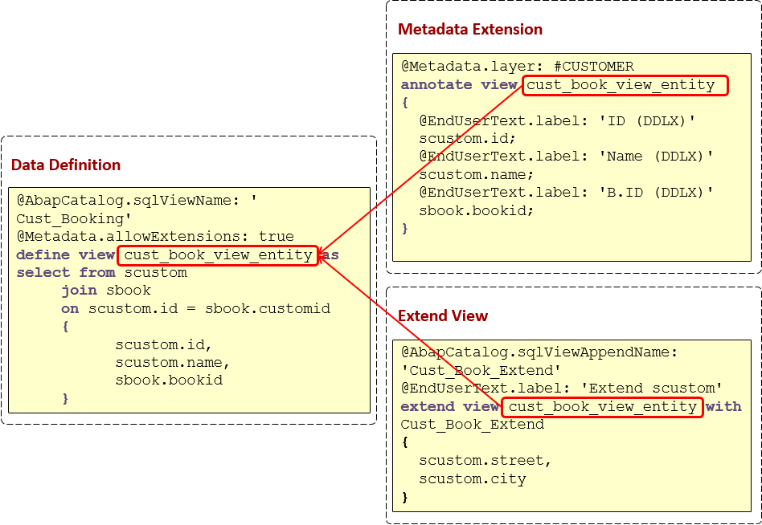

## Core Data Services

[TOC]

### Core Data Services to build design-time data-persistence models

#### Introduction
It is an infrastructure that can be used by database developers to create the underlying(persistent) data model which the application services expose to UI clients.
- Data models defined and consumed on database server rather than on application server.
- Support conceptual modeling and relationship definitions, built-in functions and extensions.

It is an enhancement of SQL which provides you with a data definition language (DDL) for defining semantically rich database tables/views (CDS entities) and user-defined types in the database.
- Expressions used for calculations and queries in the data model.
- Associations on a conceptual level, replacing joins with simple path expressions in queries.
- Annotations to enrich the data models with additional (domain specific) metadata.


#### Architecture overview

- Database layer -- This layer can be configured with most of the popular DB like Oracle, SAP HANA, etc.. It is recommended to have SAP HANA.

- Application layer -- This layer contains AS ABAP Backend and SAP Gateway, integrated using RFC calls.

- Presentation layer -- This layer contains SAP Fiori User Interface for exposing the applications for the end user.
  


### ABAP CDS Entities

ABAP CDS provides a framework for defining and consuming semantic data models on the central database of the application server AS ABAP. The specified data models are based on the data definition language (DDL) and the data control language (DCL) which are managed by ABAP Dictionary. So, a CDS entity or the enhancement of a CDS view is defined as source code in the CDS data definition. 

#### Defining ABAP CDS Views
The structure of such a view is defined by specifying the relevant database tables and the set of table fields to be used in the view. 

A CDS view is defined for existing database tables and views, or for other CDS views in ABAP Dictionary, using the ABAP CDS statement `DEFINE VIEW`. A CDS view serves to define the structure of an SQL view and represents a projection onto one or several Dictionary tables or Dictionary views. 

```
Note: CDS database views and CDS entities are part of one and the same namespace. Therefore, you must assign different names for a CDS database view and the entity.
```


- Example

  ```ABAP
  @AbapCatalog.sqlViewName: 'CUSTOMER'
  DEFINE VIEW cust_book_view_entity AS SELECT FROM scustom
  	JOIN sbook
  	ON scustom.id = sbook.customid
  	{
          scustom.id,
          scustom.name,
          sbook.bookid
  	}
  ```

  The `cust_book_view_entity` CDS entity defines a projection onto the database tables `scustom` and `sbook` by joining both tables. The generated CDS database view (`CUSTOMER`) comprises the ID, the name, and the booking ID of all customers for which the bookings exist. 


#### Activating CDS Views

When activating a CDS view, the following objects are created in the ABAP Dictionary:

- The actual CDS entity (`cust_book_view_entity`  above)
- A CDS database view (`CUSTOMER` above)


#### Accessing CDS Views in ABAP

Like regular Dictionary projection views, ABAP CDS entities can be used in ABAP Open SQL for data selection. The following method lists the customer's booking data that is stored in the underlying database tables. As demonstrated in the listing below, the CDS entity (in this case: `cust_book_view_entity`) is used for data selection in the ABAP source code.

- Example

  ```ABAP
  CLASS cl_demo_access_cds_entity IMPLEMENTATION.
  ...
  	METHOD get_data.
  	
  	  SELECT id name bookid
  	    FROM cust_book_view_entity
  	    INTO TABLE @DATA(result_data)
  	    WHERE ...   .
  	    
  	ENDMETHOD.
  ...
  ENDCLASS.
  ```


#### Overview  of Progress and  Architecture

The following figure combines the main components of the view-building architecture and also displays the most important activities that are involved in the view-building process. Using a wizard within the Eclipse-based IDE, you first create the data definition as the relevant development object. In ABAP Development Tools, the text-based DDL editor is used to write source code in which you specify the data definition for a new CDS view. For each CDS view that is defined in the data definition, you will generate – using the activation process – exactly one CDS database view and the corresponding CDS entity in the ABAP Dictionary. 


### ABAP CDS Table Functions

ABAP CDS table functions define table functions that are implemented natively on the database and can be called in CDS. As such, they support the HANA platform **code pushdown** capabilities in ABAP CDS. In code pushdown technique all calculations are performed on database layer instead of application layer, which results in fast retrieval of data, resulting cutback of application execution. 


#### Defining ABAP CDS Table Functions

A CDS table function is defined using the ABAP CDS statement `DEFINE TABLE FUNCTION` and can be used as the data source in Open SQL read statements. 

Each CDS table function includes the following components:

- The actual **CDS entity** of the table function that is generated in the ABAP Dictionary.
- The **CDS table function implementation** (ABAP class library)

```
Note: In contrast to the CDS views, the CDS table functions can be implemented using Native SQL. This implementation is done within an AMDP method of an AMDP class and is managed as an AMDP function by the AMDP framework in the database system.
```


```
Note: The name of the implementing AMDP method can only be specified in a single CDS table function(1:1 relation)
```


#### Example 

**Table Function Definition**

In the following listing, a client-specific ABAP CDS table function `TAB_FUNCTION_EXAMPLE` is defined using the DDL syntax. This table function declares two input parameters `clnt` (with the predefined value: #CLIENT) and `carrid`, and a list of elements that provide the return values of the AMDP method that implements the table function. The table function is associated with the AMDP class `CL_EXAMPLE_AMDP`, where the method `GET_FLIGHTS` is used to implement the table function.

```ABAP
@ClientDependent: true
 @AccessControl.authorizationCheck: #NOT_REQUIRED
 define table function TAB_FUNCTION_EXAMPLE
					
	with parameters @Environment.systemField: #CLIENT
			clnt:abap.clnt, carrid : s_carr_id
	returns {
		 client : s_mandt;
		 carrname : s_carrname;
		 connid : s_conn_id;
		 cityfrom : s_from_cit;
		 cityto : s_to_city;
					
		}
					
	implemented by method CL_EXAMPLE_AMDP=>GET_FLIGHTS;
```

**Table Function Implementation**

The public ABAP class (AMDP class) in this example provides the AMDP method `get_flights`, which serves as the implementation of the table function `tab_function_example`. As with any other AMDP class, `cl_example_amdp` must implement the marker interface `IF_AMDP_MARKER_HDB`. The AMDP method `get_flights` implements the data selection using Native SQL code. 

```ABAP
 class cl_example_amdp definition public.
						
	 public section.
		interfaces IF_AMDP_MARKER_HDB.
		class-methods get_flights  for table function tab_function_example.
						
	 protected section.
	 private section.
 endclass.
						
						
 class cl_example_amdp implementation.
					
	method get_flights by database function
		for hdb
		language sqlscript
		options read-only
		using scarr spfli.
		RETURN SELECT sc.mandt as client,
			sc.carrname, sp.connid, sp.cityfrom, sp.cityto
			FROM scarr AS sc
			INNER JOIN spfli AS sp ON sc.mandt = sp.mandt AND sc.carrid = sp.carrid
			WHERE sp.mandt = :clnt AND
		   		  sp.carrid = :carrid
			ORDER BY sc.mandt, sc.carrname, sp.connid;					
	endmethod.

 endclass.
```


###  Access Controls

ABAP Core Data Services (CDS) has its own authorization concept based on a data control language (DCL). The authorization concept of ABAP CDS uses conditions defined in CDS and can draw upon classical (PFCG) authorizations to check the authorizations of users.

The CDS authorization concept coexists with the classical authorization concept of SAP NetWeaver Application Server for ABAP (SAP NetWeaver AS for ABAP). You can use the concepts together or independently from another. The classical authorization concept is based on authorization objects. The authorization of a user occurs either implicitly, for example while calling a transaction, or explicitly with the statement `AUTHORITY-CHECK`. The CDS authorization concept is based on implicit authorization checks that occur during access attempts to CDS entities over service adaptation definition language (SADL) or Open SQL.

After you have created the CDS entities you want to protect in data definitions (DDLs), you use a wizard within the Eclipse-based ABAP IDE to create the access controls for the authorization objects. In access controls you define CDS roles.

A developer defines a CDS role in a separate CDS source code for a CDS entity using the DCL statement `DEFINE ROLE`. When a CDS entity is accessed using SADL or Open SQL, if no role is defined for a CDS entity, there are no restrictions on the data returned by the query. If a role is defined for the CDS entity, access control management checks the current user for authorizations. The system only reads data for which an authorization exists. CDS roles are assigned to all users implicitly.


```
Notes:
We recommend that you continue to use the classical authorization concept for start authorizations. Start authorizations check whether a user can start an application in the first place. The CDS authorization concept can be used within an application to perform instance-based authorization checks. Instance-based authorization checks the authorization of a user as defined by the data model and the data in question.
```

- Example

  ```ABAP
  @EndUserText.label: 'Show only flights for which the carrier ID is LH'
  @MappingRole: true
  define role Sflight1 {
      grant select on SFlight_Entity
          where ( ConnID ) = aspect pfcg_auth( S_CONNID, CONNID) AND CarrID ='LH';  
      }
  ```


### CDS Annotations

A CDS annotation (or annotation for short) enables you to add ABAP and component-specific metadata to the source code of any CDS entity.

In accordance with consistency and how validity of annotations is evaluated, SAP's annotations are divided into the following categories:

- **ABAP annotations** are evaluated by the ABAP runtime environment.
- **Component annotations** are evaluated by the relevant SAP framework.

You can use code completion(`Ctrl` + `Space`) to add annotations directly in a data definition, for example, before the `define` statement or within a `select` list in a CDS view. The validity of the annotation then depends on the corresponding position where you use it.

#### Example

```ABAP
@AbapCatalog.sqlViewName: 'CUSTOMER'
@AccessControl.authorizationCheck: #NOT_REQUIRED
@Metadata.allowExtensions: true
DEFINE VIEW cust_book_view_entity 
     AS SELECT FROM scustom
     JOIN sbook 
     ON scustom.id = sbook.customid
     {   
	@EndUserText.label: 'Customer ID'
	scustom.id,
	@EndUserText.label: 'Customer Name'
           scustom.name,
	@EndUserText.label: 'Customer Booking ID'
           sbook.bookid
     }
```

The example from above demonstrates how you can use annotations and at which positions you can add annotations:

- Annotations that are used before the define view statement are valid for the whole `cust_book_view_entity` CDS view:

  - `@AbapCatalog.sqlViewName: 'CUSTOMER'`: After activation, the `CUSTOMER` CDS database view is created in the ABAP Dictionary.

  - `@AccessControl.authorizationCheck: #NOT_REQUIRED`: There is no access control required to retrieve the selected data from the database.

  - `@Metadata.allowExtensions: true`: Allows you or other developers to overwrite or add annotations in a metadata extension.

- The `@EndUserText.label` annotation used before an element in the select list provides a text for the corresponding field.

Component annotations can result in the generation of other ABAP repository objects. In this case, the annotation is highlighted with a marker that provides additional information about the generated object.


#### Annotation Propagation

The value of CDS annotations can be inherited and merged between CDS entities.

##### Use

You have the following possibilities to use annotations in order to provide metadata in your data model:

- Use another CDS view as the data source
- Use a data element
- Use metadata extensions to enrich a CDS entity with customer-specific annotation values

You can build hierarchies when selecting data from other CDS views. In accordance to this hierarchy and the corresponding elements in the `select` list, the annotation values are propagated from bottom to top. In addition, you can also use metadata extensions. Note that metadata extensions can also reflect a hierarchy when assigning several metadata extensions to a CDS view.

The precedence of the annotations contained in the metadata extensions is determined by the layer of the extension. For this the following values are provided:

| Value | Description |
| ------------ | ---------------- |
| CUSTOMER     | Used by SAP's customers to define their own metadata <br> **Example** <br> `@Metadata.layer: #CUSTOMER` <br> In this example, the value CUSTOMER is used for a metadata extensions. <br><br> **Note** <br> All annotations provided in metadata extensions are compounded with the annotations in the corresponding data definition. Element annotations (scope *ELEMENT*) are propagated in the view hierarchy.CUSTOMER is the highest level. If there are several metadata extensions provided for a data definition, the metadata extension with the highest value will be considered. |
| PARTNER      | Used by SAP partners to define their own metadata            |
| INDUSTRY     | Used by SAP to define metadata for industry solutions        |
| LOCALIZATION | Used by SAP to define regional or country-specific metadata  |
| CORE         | Used by SAP to define metadata of their basis applications   |


##### Merging Annotations

To return the value of the active annotations, ABAP frameworks and development tools access metadata using the `CL_DD_DDL_ANNOTATION_SERVICE` ABAP API. This API merges the values between the used CDS view hierarchy and metadata extensions. 

**Example**

The following example visualizes merging annotations through the ABAP API:


The active annotations returned by the API for the fields of the CDS View `CDS View 2` are as follows:

| Field   | Annotation Value for @Anno |
| ------- | -------------------------- |
| field_1 | 'View 1'                   |
| field_2 | 'CORE Extension 1'         |
| field_3 | 'CUSTOMER Extension 1'     |
| field_4 | 'CUSTOMER Extension 2'     |
| field_5 | 'View 2'                   |


### Enhancing CDS Entities

You can enhance CDS entities without modifications in order to add or overwrite customer-specific functionality to a data model.

You can use the following object types to enhance CDS entities:

- **Metadata Extensions** to overwrite existing or add new metadata to a data definition.
- **Extend Views** to add new elements to a data definition from the same basis database table.

When using a metadata extension or extend view for a data definition, the `@` indicator is added at the beginning of the row from the `define view` statement.

**Example**

The following example shows you how to extend CDS entities.

In the `select list` of the `cust_book_view_entity` CDS view:

- The metadata of the `scustom.id`, `scustom.name`, and `scustom.bookid` database fields is overwritten by the metadata extension. When the corresponding data definition is consumed, the metadata of the metadata extension is considered. It is used differently in the select list. 
- The `scustom.street` and `scustom.city` database fields are added through the extend view. When you select data from the corresponding data definition, the data of these database fields will also be retrieved. Despite they are not directly used in the `select` list.



#### Metadata Extensions

You can use metadata extensions to add customer-specific requirements to SAP's CDS entities. These changes do not result in modifications.

##### Overview

A metadata extension is a transportable ABAP development object that provides CDS annotations in order to extend the CDS annotations used in a CDS view.

Metadata extensions enable you to write the annotations for a CDS view in a different document to separate them from the CDS view.

To use a metadata extension for a CDS view, you have to consider the following conditions:

1. In the definition of the CDS view, the `@Metadata.allowExtensions` annotation with the value `true` is added. This annotation allows explicitly the use of metadata extensions.
2. In the metadata extension, you have to define the name of the CDS view to be annotated in the `annotate view` statement.
3. In the Switch Framework, a switch is assigned to metadata extensions in order to control provisioning of metadata through metadata extensions at runtime. The switch state enables system administrators to control the visibility of repository objects or their components by means of switches.

##### Advantages

You can benefit from the following advantages using metadata extensions:

1. **Separation of Concerns**: Separating the metadata specified in the annotations from the implementation of the view:

   - Improves the readability of the source code
   - Simplifies the development and maintenance of the CDS view

   In addition, the metadata can be developed and updated independently of the data definition

2. **ABAP Dictionary-independent activation**: When activating a CDS view, the metadata extensions will be ignored. This results in the following advantages:

   - It reduces the number of ABAP Dictionary (mass-)activations required to develop and maintain the CDS view.
   - It speeds up the overall development process.
   - It facilitates changing the metadata of a CDS view in a running system, thereby reducing downtime.

3. **Modification-free enhancements**: Customers, partners, and industries can customize the metadata without modifying the CDS view. In addition, metadata extensions are switchable. This means the metadata can be specifically enabled or disabled depending on the use case.
##### Activation

In general, in a metadata extension only those annotations are permitted that do not affect the ABAP Dictionary activation/generation or the activation/generation of secondary objects (for example, OData services). Currently only the ABAP annotation `@EndUserText` and the component-specific annotations `@UI` can be specified in metadata extensions. A syntax error occurs if annotations that are not permitted are specified.

##### Obtaining Merged Annotations

The metadata contained in metadata extensions is only available to consumption clients that access the CDS view metadata using the ABAP API `CL_DD_DDL_ANNOTATION_SERVICE`. In this case, metadata in the metadata extensions is merged together with the metadata in the CDS view and also with the metadata that is inherited from underlying views (and metadata extensions) in the view hierarchy.


#### Extend Views

In the context of Core Data Services (CDS), you create an extend view to add more fields from the basis entities to the associated CDS view without making any modifications.

You can create extend views on the basis of the **Extend View** template that is provided in the creation wizard of data definitions.

**Template**

```ABAP
@AbapCatalog.sqlViewAppendName: '${sql_view_append_name}'
@EndUserText.label: '${ddl_source_description}'
extend view ${view_name} with ${ddl_source_name_editable} {
    ${data_source_name}.${element_name}
}
```

In this template, the following placeholders are provided and need to be adapted:

- `${sql_view_append_name}`: Name of the append structure to be created in the ABAP Dictionary when activating the extend view
- `${ddl_source_description}`: Description to provide further information about the extend view
- `${view_name}`: Name of the CDS view to be enhanced in a data definition
- `${ddl_source_name_editable}`: Name of the extend view object itself
- `${data_source_name}`: Name of the data source (for example, a database or a CDS view) from which you want to add new database fields to the CDS view
- `${element_name}`: Name of the database field or element (for example, an association) to be added

In the `extend view` statement, you define the name of the CDS view where you want to add further database fields. After the keyword `with`, you enter the name of the extend view itself.

```
Note:
You can only add those database fields (or constants) that are contained in the same basis database that is used in the select list of the CDS view.
```


### CDS Associations and Path Expressions

Here demonstrates concept of CDS associations and coding path expression in SQL statements and in CDS view.

SAP wants us to use associations instead of joins because they are closer to "conceptual Thinking". Association is basically not a join as such, it is just metadata about possible join connection. It's Join on Demand. Actual join is created when the association is used in a path expression.

#### Association Syntax

```
... ASSOCIATION [min..max] TO target [AS _assoc] ON cond_exp [WITH DEFAULT FILTER cond_exp] ...
```

Defines an <u>association</u> of the name `_assoc` in a SELECT statement of a CDS view. An association associates the current CDS view as a source data source with the target data source `target` specified in the definition of the association using an *ON* condition `cond_exp`. A data source `target` can be a database table defined in ABAP Dictionary, a <u>classic view</u>, an <u>external view</u>, or a <u>CDS entity</u>.

When a CDS view is activated with path expressions, every association specified here is transformed to a join expression. The source data source represents the left side and the target data source represents the right side. The *ON* condition of the association is added to the *ON* condition of the join. By default, the category of the join is determined by where the <u>path expression</u> is used:

- After `FROM`, it is an inner join (INNER JOIN)
- In all other locations, it is a left outer join (LEFT OUTER JOIN)

**Addition 1**

`...[min..max]`

Defines the cardinality of the target data source of a CDS view, which is defined with an association *ASSOCIATION*. The square brackets `[ ]` are part of the syntax. For `min` and `max`, positive integers (including 0) and asterisks (*) can be specified:

- `max` cannot be 0.
- An asterisk * for `max` means any number of rows.
- `min` can be omitted (set to 0 if omitted).
- `min` cannot be *.
- When an association is used in a <u>WHERE condition</u>, 1 must be specified for `max`.

If the cardinality is not defined explicitly, the cardinality "to 1" is used implicitly (`[min..1]`).

**Addition 2**

`... AS _assoc`

Defines the name `_assoc` of an association defined using `ASSOCIATION` of a CDS view. If no name is defined explicitly using `AS`, `_assoc` is set implicitly to the name of the target data source. The name `_assoc` must comply with the naming rules for names.

It is advisable to use an underscore `_`as the first character of the association name. 

- Example

  The following CDS views provide the same result.

  ```
  @AbapCatalog.sqlViewName: 'DEMO_CDS_ASSOC' 
  @AccessControl.authorizationCheck: #NOT_REQUIRED 
  define view demo_cds_association( 
      _spfli_scarr, 
      id, 
      carrier, 
      flight, 
      departure, 
      destination 
    ) 
    as select from 
      spfli 
      association [1..1] to scarr as _spfli_scarr on 
        $projection.carrid = _spfli_scarr.carrid 
      { 
            _spfli_scarr, 
        key spfli.carrid, 
        key _spfli_scarr.carrname, 
        key spfli.connid, 
            spfli.cityfrom, 
            spfli.cityto 
      } 
  ```

  ```
  @AbapCatalog.sqlViewName: 'DEMO_CDS_JOIN' 
  @AccessControl.authorizationCheck: #NOT_REQUIRED 
  define view demo_cds_scarr_spfli( 
      id, 
      carrier, 
      flight, 
      departure, 
      destination 
    ) 
    as select from 
             spfli 
        join scarr on 
          scarr.carrid = spfli.carrid 
      { 
        key spfli.carrid, 
        key scarr.carrname, 
        key spfli.connid, 
            spfli.cityfrom, 
            spfli.cityto 
      } 
  ```


### Virtual Data model types

#### Introduction

A **Virtual Data Model (VDM)** is a structured representation of HANA database views which was introduced to be used in SAP HANA Live for SAP Business Suite. It provides direct access to SAP business data using standard SQL or OData requests.


#### VDM View types

The classification of VDM is used only for SAP internal structuring and interpretation of the CDS views. Releasing CDS views for customers and partners is controlled by additional internal classification of the views.

Different VDM view types are:

- Basic
- Composite
- Consumption

##### Basic View

A basic view is created on top of DDIC tables/views, which means only a basic view is a view which interacts with database for fetching data. The fetching of data directly from database results as core data for other type of view types without any data redundancies.

<u>Data source for basic view is raw data directly from DDIC tables/views.</u>

**Syntax**: `@VDM.Viewtype: #BASIC`

##### Composite View

A composite view is created on top of basic views, which means composite views doesn’t interact with database directly for data, but instead thorough dimension result set of basic views. The multiple basic views can be used with join / association for fetching data and doing calculations (eg:. using built-in-expressions and functions) on retrieved data  to consume in different analytics tools using consumption view.

<u>Data source for composite view is basic views.</u>

**Syntax**: `@VDM.Viewtype: #COMPOSITE`

##### Consumption View

A consumption view is created on top of composite view, which means consumption view doesn’t interact with DDIC tables/views or basic views. The consumption view is written on top of composite view which provides factual and cube data. <u>This view is used to expose the data to different analytics tools</u> (such as HTML, SAP Business Objects, Analysis for Excel, SAP Lumira, etc..) which helps to create reports and different visualization for presenting Business data. 

<u>Data source for consumption view is composite views.</u>

**Syntax**: `@VDM.Viewtype: #CONSUMPTION`


#### Analytics Data Category

Only using VDM view types is not just enough for consuming CDS view in analytic tools. We have to declare **Data Category** for each particular ABAP CDS views with VDM view type annotations.

The different types of Analytics data category are:

1. Dimension
2. Fact
3. Cube
4. Aggregation level

##### Dimension

The view that represents master data is annotated as `@ObjectModel.dataCategory: #DIMENSION`. If we have to use any of the view for replication or for a query, we should use `@Analytics.dataCategory: #DIMENSION`.

##### Fact

 The view represents transactional data (center of star schema). Usually, it contains measures. Typically, these views are necessary for replication, therefore, views listed as Fact data category should not be joined with master data views. 

**Syntax**: `@Analytics.dataCategory: #FACT `

##### Cube

The Cube view (like #FACT) represents factual data, but cube view does not have to be without redundancy, which means joins with master data are possible. The consumption views are built on top of CUBE views, where data is replicated from facts. 

**Syntax**: `@Analytics.dataCategory: #CUBE`

##### Aggregation Level

The view using data category as aggregation level indicates that CDS view is of type projection. For, this type of view analytics manager offers write-back functionality. In this type of view associations are not allowed and elements can be renamed. 

Data source of this type of views is a CDS view with `dataCategory = #CUBE`, which supports `Analytics.writeBack.className` annotation. 

**Syntax**: `@Analytics.dataCategory: #AGGREGATIONLEVEL `

| Data Category     | Represent Master data | Represent Transaction data | Can be joined with master data | Offer Write back | Contain Measure |
| ----------------- | --------------------- | -------------------------- | ------------------------------ | ---------------- | --------------- |
| Dimension         | True                  | False                      | True                           | False            | False           |
| Fact              | False                 | True                       | False                          | False            | True            |
| Cube              | False                 | True                       | True                           | False            | True            |
| Aggregation Level | False                 | False                      | True                           | Ture             | True            |

