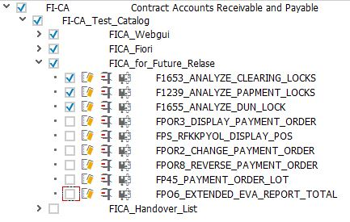
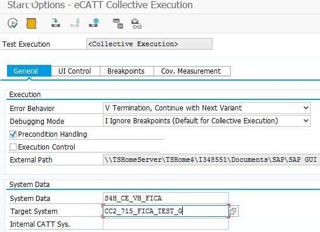
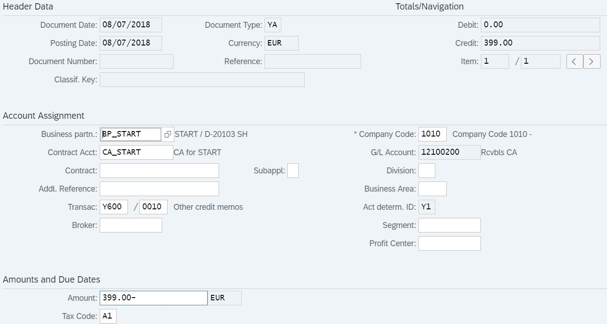
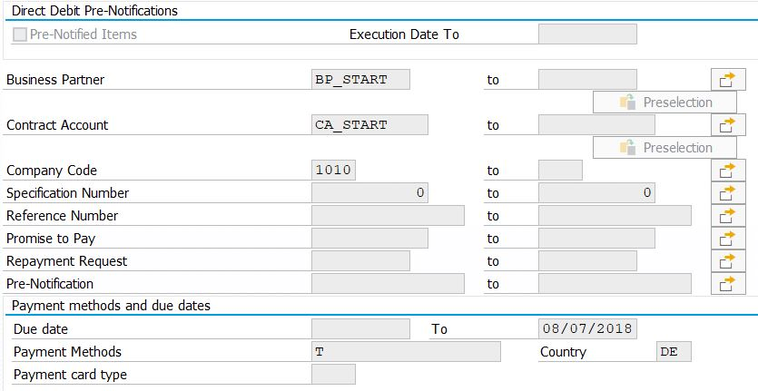

### Start Automation Tool

### ECE

#### Create a test case in ECE

1. Sign in ECE, T_Code "start_home"
2. Choose **create**, select **Launch with Url**, *System Data Container* in ECE&ECA is `S4H_CE_VH_FICA`, choose *Target System* you want to run test cases on. Paste corresponding Url in `Url Details`
3. Click on **create**, record test operations and save. Package is `ECATT_FICA_CI`. Once you need mark what you have done, you need to create a new request.

#### Transfer to ECA

1. In ECE, use T_Code `se09`, choose **Display**

   Notice: click subitem of the request first, and click "release directly", then the request, click "release directly".

2. In ECA, use T_Code `se09`, click **Transports**, it will show "Successful Imports" if release has been received.

### ECA

#### Manage test plan in ECA

1. You should first add new test cases into Test Catalog.

   Enter "Test -> Test Workbench -> Test Organizer -> Test Catalog Management", select `FI-CA_Test_Catalog`, click **Change**. 

   Choose the place you want to add in, click "On Same Level". Choose "Test Case", Type "eCATT", fill the case name in the "Test Case Key" field. Then save.

2. Then add test cases into Test Plan.

   Enter "Test -> Test Workbench -> Test Organizer -> Test Plan Management", select `S4H_CE_START_SCRIPT_FICA`, click **Change**

   Directory: `Finanzwesen` --> `Vertragskontokorrent`--> `FI-CA_Test_Catalog`, check your new cases, click **Generate** 

3. Test Packages Management

   The same route as step 2, click **Test Packages**

   You can create new packages to manage your test plan.

4. If you need to delete some test cases, you should delete them in ECE first and transport to ECA.

#### Manage Automatic Test

Routine: Test-> Test Workbench -> Test Organizer -> Test Plan Management

Select `S4H_CE_START_SCRIPT_FICA`, click "Test Packages".

1. You can create new packages to manage your test plan.

   Notice: 

   Until 1811, only these test plans need to be covered.

    

2. To run test packages, choose the test package, click `Status Analysis`, then choose corresponding test plan or test plan groups, click `Automatic Test`. The Parameters you need to set are in below picture.

   

#### Dependencies

- For test case `FP09_PROCESS_RETURNS_LOT`, parameters need to be modified in ECE before weekly test.

  1. In CC2/CCF 715, post a document with information below, record your document number.

     

  2. Then use T_code `FPY1`, execute Payment Run, parameters like below, change date to the document date.

     

     In **Custom Selections** tab, enter corresponding document number.

     In **Bank  Selection** tab, select `PayingCCde` 1010, `Payt Meth.` T.

     In **Logs** tab, check all `additional log`, and switch `Problem Class` to **Additional Information**.

     After running the task, record the clearing document number in the log, and modify corresponding value in ECE test script. Then transfer the request to ECA.

- For  `FPDEP_EXP_BP_DATA_EXTRA`, `FPDEP_IMP_BP_DATA_IMPORT`, `FPDEP_DEL_DELETE_PARTNER`, the corresponding posting period should be closed before running. 

  When you get error message like "Period is not closed." You should use `GL_ACCOUNTANT` to log in front system and find the `Manage Posting Periods ` app.

  In the field `Posting Period Variant`, check all items of "1010". In the field `Account Type`, choose `V(Contract accounts)`, then choose the result line, click `Set Posting Periods -> Open Periods` to adjust.

  Note that in `Normal Periods`, enter your fiscal year period like `from "2018 01" to "2018 12"`, in `Adjustment Periods`, enter fiscal year period like `from "2018 13" to "2018 16"`. When fiscal year period 2018 is active, others are inactive. You should make your testing data inactive.

  Once it turns out error even you set correctly like above, you may also check  `+(Valid for all account types)` and `S(G/L accounts)` in `Account Type` field, and adjust their periods. It may affect others' testing, so be careful.

#### Other Reminders

   Some test cases may fail, sometimes it will pass if you run it again.

   There are several test cases which may fail due to system lock. Run them again half an hour later.

#### Test Automation Report KPI

Run **TESTCOV_BB** / **TESTCOV_BB_DETAIL** in **ER6.001** with variant **FICA_APP** 