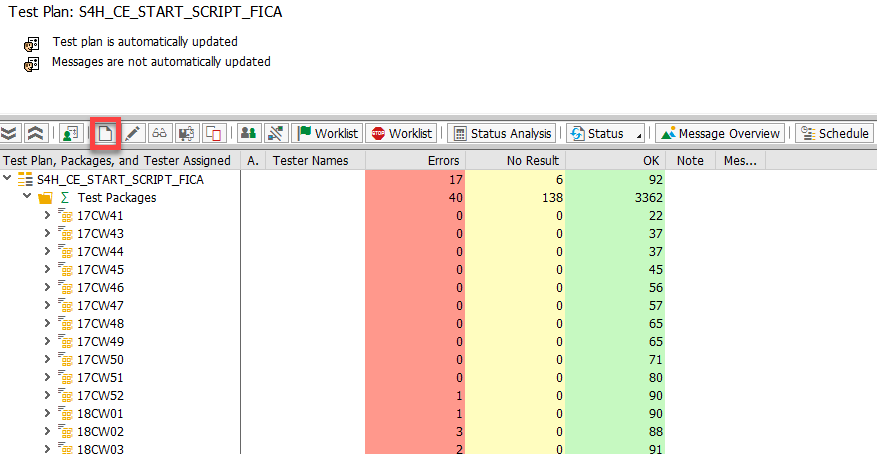

### Start Automation Tool

### ECE

#### Maintain Target System

T_Code `secatt`, you can maintain system data here. If new target systems need to be added, use T_Code `sm59` to create and add.

#### Create a test case in ECE

1. Sign in ECE, T_Code "start_home"
2. Choose **create**, select **Launch with Url**, *System Data Container* in ECE&ECA is `S4H_CE_VH_FICA`, choose *Target System* you want to run test cases on. Paste corresponding Url in `Url Details`
3. Click on **create**, record test operations and save. Package is `ECATT_FICA_CI`. Once you need mark what you have done, you need to create a new request.
4. Notice that you need to design test data and the check to make sure the test script can be tested repeatedly. 

#### Transfer to ECA

1. In ECE, use T_Code `se09`, choose **Display**

   Notice: click subitem of the request first, and click "release directly", then the request, click "release directly".

2. In ECA, use T_Code `se09`, click **Transports**, it will show "Successful Imports" if release has been received.

### ECA

In ECA,  `Test Plan Management` and `Test Catalog Management` will be used frequently.  Add them to Favorites. Full path in the following picture.

#### Manage Test Catalog

We use Test Catalog to manage test scripts. You can regard it as a root directory for all your test scripts. Enter in `Test Catalog Management`. For FICA, we already maintain a catalog. Search for `FI-CA_Test_Catalog` and add it to favorites.

We can see the structure of this catalog. 

- `FICA_Webgui` and `FICA_Fiori` cover all test scripts we need to run weekly.
- `FICA_for_Future_Release` is a directory to store test scripts for those in for future release. Once these apps are released, we need to update the corresponding test scripts and move them to corresponding directory. 
- `FICA_Handover_List`, this directory stores all test scripts handed over.
- `FICA_Pre_Steps`, this directory is for STE colleagues to create test data in new test system. More details in `\\cnpvgl000\Restricted\FGI\50_Project\FICA_on_Cloud\60_Quality\START_HANDOVER\Pre-steps`.

Each time you transport new test scripts from ECE to ECA, you need to add them in your test catalog. To do this, follow these steps:

1. In `Test Catalog Management`, select `FI-CA_Test_Catalog`, click **Change**. 

   

1. Use **On Same Level** or **As Subnode** to choose the place you want to store your script. Choose **Test Case**, Type **eCATT**, fill the case name in the "Test Case Key" field. Then save.

   

#### Manage Test Plan

For FICA, we already have a test plan for weekly regression test. Enter in `Test Plan Management`, search for `S4H_CE_START_SCRIPT_FICA` and add it to favorites.

To edit your test plan, follow these steps:

1. Enter in **Test Plan Management**, select `S4H_CE_START_SCRIPT_FICA`, click **Change**

   

2. Directory: `Node text not found` --> `Node text not found` --> `Finanzwesen` --> `Vertragskontokorrent`--> `FI-CA_Test_Catalog`, check all cases you want to include, click **Generate** 

   

3. If you need to delete some test scripts, you should uncheck them in test plan and test catalog, then delete them in ECE first and transport to ECA.

#### Manage Automatic Test

Enter in `Test Plan Management`, select `S4H_CE_START_SCRIPT_FICA`, and click "Test Packages". Then you will see all test packages in our test plan.

Usually, we run automatic test once a week or every two weeks. Before you run automatic test ,you should create a new test package to make it easier to differentiate from the previous. The naming conventions are `year + CW + week`, `18CW03` means the third week in 2018. To create a test package, click **Create** button.

1. You can create new packages to manage your test plan.

   Notice: 

   Until Now(Week 42 in 2018), only these test plans need to be covered. (The five test scripts unchecked need to be updated).

    

   After selecting, click **Generate** button. Fill in the name and continue to finish the process. The Package is `ECATT_FICA_CI`. Then click "continue" several times.

   

2. To run test packages, choose the test package you created, click `Status Analysis`.

   

3. Then choose corresponding test plan or test plan groups, click `Automatic Test`. 

   

4. The Parameters you need to set are in below picture. Usually, you only need to set System Data to `S4H_CE_VH_FICA`, and specify the target system you want to run automatic test on. We have already maintain these systems' RFC call. Then click **Execute** button.

   

#### Dependencies

- For test case `FP09_PROCESS_RETURNS_LOT`, parameters need to be modified in ECE before weekly test.

  1. In CC2/CCF 715, post a document with information below, record your document number.

     

  2. Then use T_code `FPY1`, execute Payment Run, parameters like below, change date to the document date.

     

     In **Custom Selections** tab, enter corresponding document number.

     In **Bank  Selection** tab, select `PayingCCde` 1010, `Payt Meth.` T.

     In **Logs** tab, check all `additional log`, and switch `Problem Class` to **Additional Information**.

     After running the task, record the clearing document number in the log, and modify corresponding value in ECE test script. Then transfer the request to ECA.

- For  `FPDEP_EXP_BP_DATA_EXTRA`, `FPDEP_IMP_BP_DATA_IMPORT`, `FPDEP_DEL_DELETE_PARTNER`, the corresponding posting period should be closed before running. 

  When you get error message like "Period is not closed." You should use `GL_ACCOUNTANT` to log in front system and find the `Manage Posting Periods ` app.

  In the field `Posting Period Variant`, check all items of "1010". In the field `Account Type`, choose `V(Contract accounts)`, then choose the result line, click `Set Posting Periods -> Open Periods` to adjust.

  Note that in `Normal Periods`, enter your fiscal year period like `from "2018 01" to "2018 12"`, in `Adjustment Periods`, enter fiscal year period like `from "2018 13" to "2018 16"`. When fiscal year period 2018 is active, others are inactive. You should make your testing data inactive.

  Once it turns out error even you set correctly like above, you may also check  `+(Valid for all account types)` and `S(G/L accounts)` in `Account Type` field, and adjust their periods. It may affect others' testing, so be careful.

#### Other Reminders

Some test cases may fail, sometimes it will pass if you run it again.

There are several test cases which may fail due to system lock. Run them again half an hour later. Or you can use `sm12` in backend system to delete the lock.

###  Test Automation Report KPI

Run **TESTCOV_BB** / **TESTCOV_BB_DETAIL** in **ER6.001**， “Goto->Get->Variant” with variant **FICA_APP**.