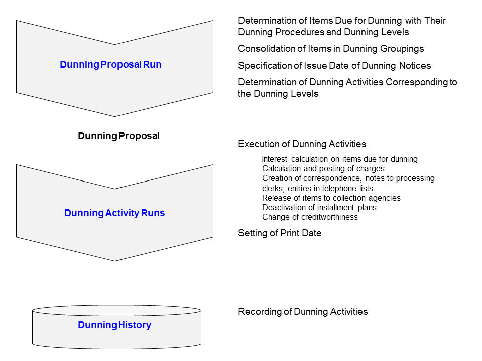

### Unit 8 Dunning and Collections

#### Dunning - Terminology
##### Dunning Procedure: Definition

A business partner is dunned for:

- **Overdue receivables**
- **Additional receivables** (dunning charges, dunning interest)

The dunning procedure determines:

- The conditions under which a business partner is to be dunned
- The dunning steps that are carried out

When you define dunning procedure, you must take the following into consideration:

- What are the different steps if you must perform dunning more than once? 

  **Dunning levels**

- How do you perform dunning?

  **Dunning activities**

- What are your dunning conditions?

  **Prerequisites** ---- Minimum amount, number of days in arrears

  **Action** ---- Dunning notice, cancellation of agreements

  **Dunning charge** ---- Fixed, graduated, or variable

##### Dunning Procedure: Function

A dunning procedure is made up of individual dunning levels. You enter various information for each dunning level, such as the minimum amount of an overdue item and the number of days in arrears that must be reached before the item is placed in the next dunning level.

#### Configuration and Execution of the Dunning Program

The **dunning procedure** is the driver for dunning. You can define different dunning levels for each dunning procedure. These **dunning levels** determine the dunning frequency, the calculation method by which the dunning charges are determined, and how interest is calculated and posted. For each dunning level, you can also define currency-specific minimum amounts and **dunning activities**.

##### Using the Dunning Program

A dunning run is carried out in **two stages**:

1. All due items are identified and grouped together.

   = **dunning proposal run (FPVA)**

2. Dunning activities are carried out.

   = **dunning activity run (FPVB)**

Before starting the dunning run, you should ensure that the posting situation is as up-to-date as possible, which means that all existing payments should be posted and a clearing run executed. This way, you avoid dunning items that have already been paid.

##### Dunning Proposal Run

The dunning proposal run determines all items due for dunning and combines them in a dunning grouping.

Once a business partner is included in a dunning proposal, he or she will not be included in another proposal run. Only the dunning activity run enters the system date as the execution date of the dunning (MDRKD) in the dunning header. The dunning proposal then becomes dunning history. This check prevents duplicate dunning letters in case you postpone the dunning activity run.

You cannot run a second proposal run over the same items/accounts unless the first run is deleted (choose Environment --> Delete Dunning Proposal Run).

##### Dunning Activity Run

You initiated a dunning activity run in much the same way as a dunning proposal run. Enter the necessary parameters and then schedule the program run.

The dunning levels and appropriate dunning activities are determined based on the dunning groupings and items for dunning.

A dunning activity run can result in a charge or interest posting, or updates in the dunning history and dunning activity history.

The following figure shows the relationship.

